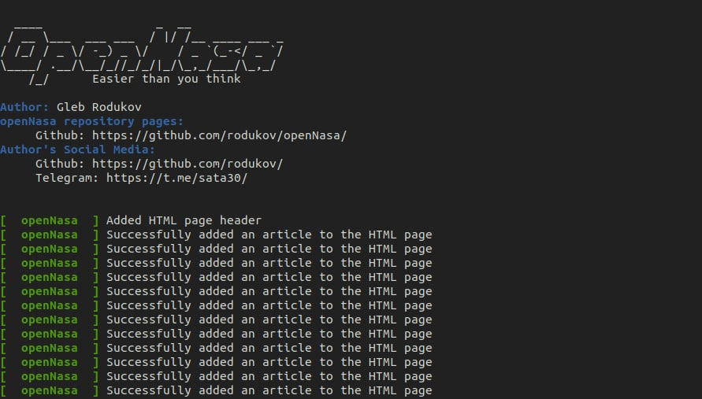
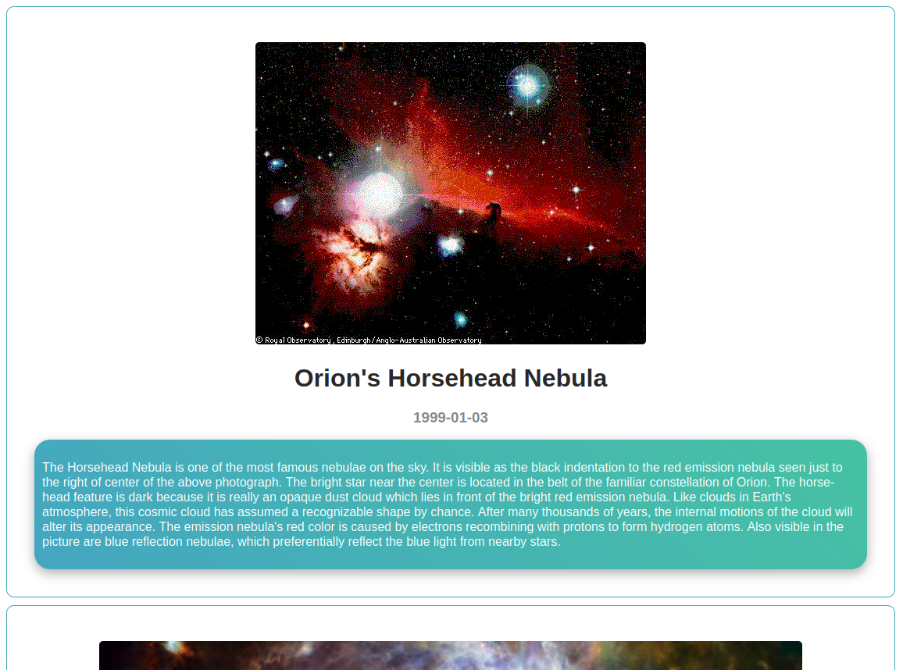

<div align="center">
<p>
    <a>
      
    </a>
    <a>
      
    </a>
    <a>
      
    </a>
    <a href="https://github.com/rodukov/openNasa/stargazers">
      
    </a>
    <a href="https://github.com/rodukov/openNasa/releases/latest">
      
    </a>
    <a href="https://github.com/rodukov/openNasa/search?l=python">
      
    </a>
    <a href="https://github.com/rodukov/openNasa/blob/master/LICENSE">
      
    </a>
</p>
</div>

<p style="text-align: center;"></p>

# openNasa

This software can parse pictures from the Nasa server<br><br>

🔻 Register an API key(recommended): https://api.nasa.gov/index.html#signUp<br>
## You can use this API Key's:
`gyxu6CjGjk6emd5lHPwTAuHk7d1mDW2z0UpAKqod` `GjGlCo3HVL0i9F3cLTl5Ma66CIaP8ct1evHONPxd` <br>
`IQz7ccI0XW3JvWqgmq6X3XbzhcDF1kMqvt88ohei` `NKJJg9fSLANIDTelc1IwuYjgoySmgehHH73ByzIQ` <br>
`j7R3c4rmgeeW8fo9Ol08rLXtmE3G7tkJE6XlwmgC` `Q0kTGij4zDfhFtEGuhY9oOPtBqWyGx7s2Me7bf8l` <br>

## About program
🔺 This program receives the user's settings, then, based on them, makes requests to NASA API, can form an html page if the user wants this, or just display the results in the terminal;<br>
🔺 The code of the program is readable for the average user, I tried to write it competently, I signed the important points;<br>
🔺 The results will not be repeated, thanks to the `_history` variable;<br>
🔺 Now there is customization of the program. To do this, edit the `modules/config.py` file to your liking;<br>
🔺 If the project gets 10 stars, I will move the code to Vue.js<br>

## Screenshot


## Install program
👨‍💻 You can use a one-line code installation
```bash
git clone https://github.com/rodukov/openNasa && cd openNasa
```

## Using the program
ℹ️ To understand how to use the program, you need to write the --help flag
```bash
$ python3 client.py --help
usage: client.py [-h] [-k KEY] [-b BUILD] [-y YEAR] [-m MONTH] [-d DAY]
                 [-c COUNT]

Information about using the openNasa software

optional arguments:
  -h, --help            show this help message and exit
  -k KEY, --key KEY     NASA API key
  -b BUILD, --build BUILD
                        If True the script will create an html page, if False
                        it will output the results to the terminal
  -y YEAR, --year YEAR  Enter the desired year, for random results write
                        'random'
  -m MONTH, --month MONTH
                        Enter the desired month, for random results write
                        'random'
  -d DAY, --day DAY     Enter the desired day, for random results write
                        'random'
  -c COUNT, --count COUNT
                        Enter the number of articles, for example, '30',
                        without quotes
```

## Examples of use
📌 This example will create an html page with 30 articles and random dates
```bash
python3 client.py --key gyxu6CjGjk6emd5lHPwTAuHk7d1mDW2z0UpAKqod --build True --year random --month random --day random --count 30
```
📌 The example will also build an html page, but will only highlight articles from 2020. Number of articles 25
```bash
python3 client.py --key gyxu6CjGjk6emd5lHPwTAuHk7d1mDW2z0UpAKqod --build True --year 2020 --month random --day random --count 25
```
📌 This example will not build an html page, but will display the results in the terminal. Dates are random. Number of results 35
```bash
python3 client.py --key gyxu6CjGjk6emd5lHPwTAuHk7d1mDW2z0UpAKqod --build False --year random --month random --day random --count 35
```

